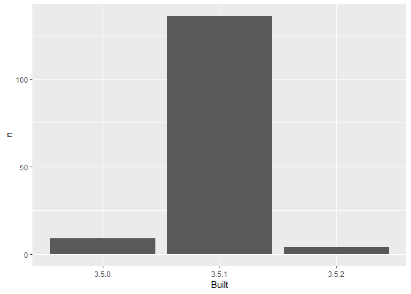

03\_barchart-packages-built.R
================
rlank
Tue Jan 15 18:20:28 2019

``` r
## remember to restart R here!

library(readr)
library(here)
```

    ## Warning: package 'here' was built under R version 3.5.2

    ## here() starts at C:/Users/rlank/Documents/tmp/packages-report

``` r
library(ggplot2)
library(dplyr)
```

    ## 
    ## Attaching package: 'dplyr'

    ## The following objects are masked from 'package:stats':
    ## 
    ##     filter, lag

    ## The following objects are masked from 'package:base':
    ## 
    ##     intersect, setdiff, setequal, union

``` r
## make a barchart from the frequency table in data/add-on-packages-freqtable.csv

## read that csv into a data frame
## hint: readr::read_csv() or read.csv()
## idea: try using here::here() to create the file path

package_version_freq_tbl <- read_csv(here::here("data/add-on-packages-freqtable.csv"))
```

    ## Parsed with column specification:
    ## cols(
    ##   Built = col_character(),
    ##   n = col_double(),
    ##   prop = col_double()
    ## )

``` r
## if you use ggplot2, code like this will work:

ggplot(package_version_freq_tbl, aes(x = Built, y = n)) +
  geom_col()
```



``` r
## write this barchart to figs/built-barchart.png
## if you use ggplot2, ggsave() will help
## idea: try using here::here() to create the file path
ggsave(here::here("figs/built-barchart.png"))
```

    ## Saving 7 x 5 in image

``` r
## YES overwrite the file that is there now
## that's old output from me (Jenny)
```
